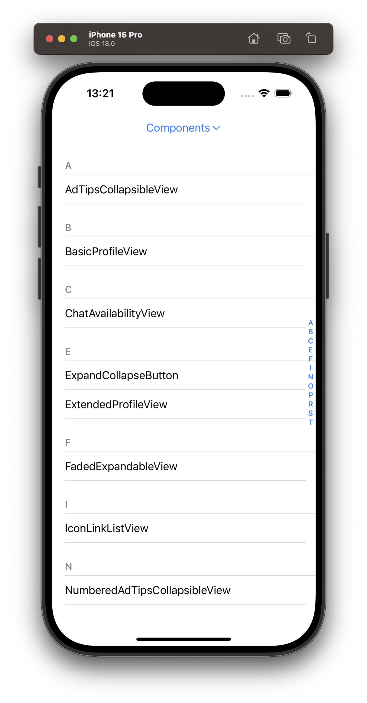
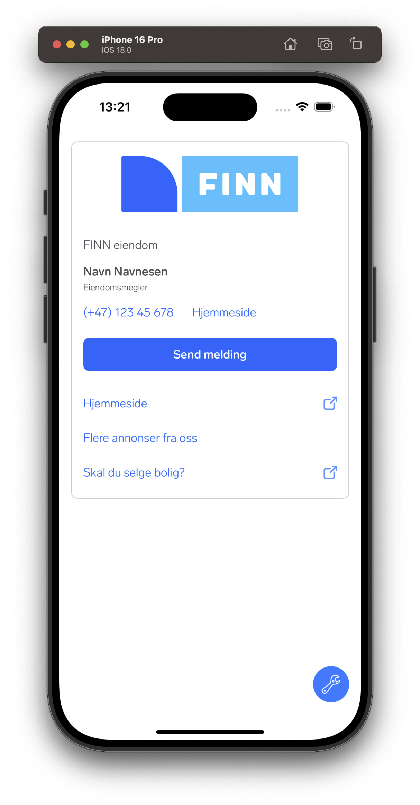
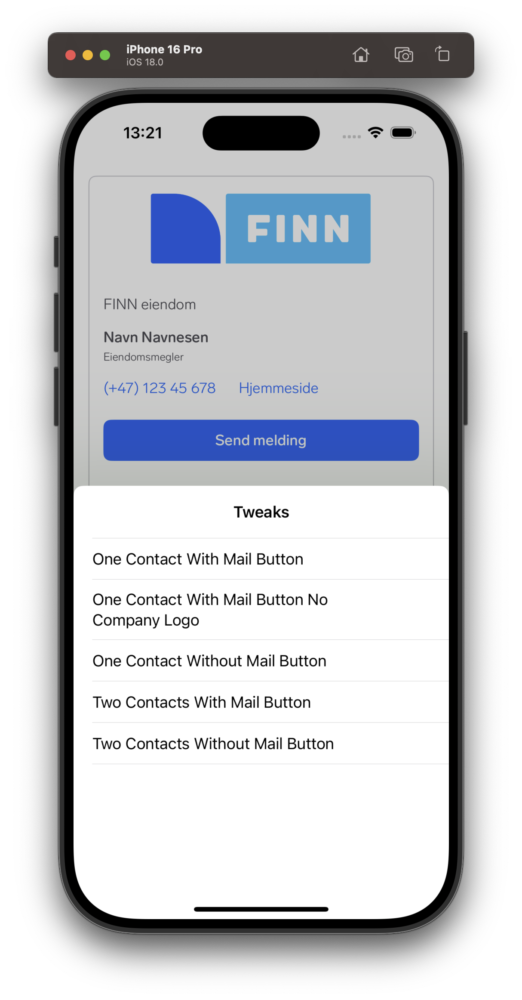

# DemoKit
**DemoKit** is a Swift helper library designed to simplify the creation and maintenance of a demo app for showcasing your components, view controllers, or any other elements you’d like to demonstrate. While Xcode provides a great way to preview content using `#Preview`, these previews are limited to the Xcode environment. By creating a dedicated demo app with DemoKit, you can distribute it to your team, enabling them to test and interact with your demos directly on their devices. This approach fosters better collaboration and provides a more comprehensive testing experience.

Currently these types are supported for both demos and snapshots:

- `UIView`
- `UIViewController`
- `View`
- `PreviewProvider`

DemoKit automatically remembers the last `Demoable` you viewed and the selected `TweakingOption` (if applicable). This information is stored in `UserDefaults`, allowing the app to reopen directly to the last demo and configuration when restarted. This feature simplifies navigation, making it easier to continue exploring or testing where you left of. This can be useful if you're not using Xcode previews and need to develop using the simulator.

## Screen overview
| What | Image | Description |
| - | - | - |
| Root view |  | Group the components/views you want to showcase into one or more `DemoGroups`.<br><br>The root view will present all of the available demos within this group. Selecting one will navigate you to that demo. |
| Demo presentation |  | Demo your view.<br><br>If your view supports more than one configuration that you want to demo you can add tweaks to it, which will let you reconfigure the view according to the selected tweak. Changing a tweak is available through the wrench button. |
| List and select tweak |  | If your view supports tweaks tapping the "wrench button" will allow you select a tweak to reconfigure the your demo.<br><br>Tweaks can be useful if you have a view that can change appearance/layout dependending on the way the view is configured.  |

## Setup
### Create demos by conforming to `Demoable`
To create a demo, conform your type to the [`Demoable`](https://github.com/finn-no/DemoKit-iOS/blob/main/Sources/DemoKit/Public/Protocols/Demoable.swift) protocol. This ensures it integrates with DemoKit and is displayable in the app.

The [`Demoable`](https://github.com/finn-no/DemoKit-iOS/blob/main/Sources/DemoKit/Public/Protocols/Demoable.swift) protocol is the core of DemoKit. It defines the blueprint for any component, view, or feature you want to showcase. By conforming to `Demoable`, your type becomes a demo item that can be displayed and interacted with in the demo app.

#### What is `Demoable`?
`Demoable` is designed to be implemented by either a `UIView`, `UIViewController`, `View` or `PreviewProvider`. It provides several properties that customize how the demo is presented and interacted with. All of these properties have default values, making it easy to get started with minimal configuration. See the protocol itself for available properties, and the default values.

#### Example usage
Here's how you'd create a simple `Demoable` view, in this case a `UIView`. Conforming to the protocol is sufficient, unless you want to override any of the properties.

```swift
import UIKit
import DemoKit

class MySimpleDemoView: UIView, Demoable {
    override init(frame: CGRect) {
        super.init(frame: frame)
        backgroundColor = .systemBlue
    }

    required init?(coder: NSCoder) {
        fatalError("init(coder:) has not been implemented")
    }
}
```

### Group demos using the `DemoGroup` protocol
The [`DemoGroup`](https://github.com/finn-no/DemoKit-iOS/blob/main/Sources/DemoKit/Public/Protocols/DemoGroup.swift) protocol is used to organize and categorize your demos into logical groups. Each group represents a collection of related demos, making it easier for users to navigate and explore them in your demo app. However, there's no shame in only using a single group for all your demos.

#### What is `DemoGroup`?
A `DemoGroup` defines a set of demos and how they are presented in the app. It’s typically implemented as an enum, where each case corresponds to a specific demo. This makes the implementation lightweight, easy to maintain, and expressive.

When implementing a `DemoGroup` as an enum with `String` as the raw value, certain default behaviors are provided to make setup even simpler. This approach leverages the raw value to automatically generate key properties like titles.

#### Key properties

| Property | Type | Description |
| - | - | - |
| `numberOfDemos` | `Int` | The total number of demos in the group. |
| `groupTitle` | `String` | The title displayed for the group in the navigation bar or group selector.<br>Default value: A stringified version of the `DemoGroup` type. |

#### Key methods

For the methods that take `index` as a parameter this value refers to the index of the demo, and will always be between `0` and `numberOfDemos - 1`.

| Method | Return type | Description |
| - | - | - |
| `demoGroupItem(for index: Int)` | [`DemoGroupItem`](https://github.com/finn-no/DemoKit-iOS/blob/main/Sources/DemoKit/Public/Protocols/DemoGroupItem.swift) | Returns the metadata (e.g., title, subtitle) for a demo at the specified index. This is used to populate the list of demos for this group. |
| `demoable(for index: Int)` | [`Demoable`](https://github.com/finn-no/DemoKit-iOS/blob/main/Sources/DemoKit/Public/Protocols/Demoable.swift) | Returns the actual demo (`Demoable`) at the specified index. This is invoked when a user selects a demo from the list. |

#### Example usage

```swift
import UIKit
import DemoKit

// An enum, where all cases refers to a specific demo in your app.
// Using an enum, with `String` as the raw value, will help you out
// removing some boilerplate for the setup.
enum ComponentDemoGroup: String, CaseIterable {
    case mySimpleDemo
    case buttons
}

extension ComponentDemoGroup: DemoGroup {
    // The title of this group of demos.
    static var groupTitle: String { "Components" }

    // How many demos does this group contain?
    static var numberOfDemos: Int {
        allCases.count
    }

    // A `DemoGroupItem` will be used to populate the `UITableView`
    // that lists all demos within this group.
    static func demoGroupItem(for index: Int) -> DemoGroupItem {
        allCases[index]
    }

    // Return the `Demoable` for the index. Will be called when the user
    // taps a demo from the list.
    static func demoable(for index: Int) -> Demoable {
        switch allCases[index] {
        case .mySimpleDemo:
            MySimpleDemoView()
        
        case .buttons:
            ButtonDemoView()
        }
    }
}

// Since this is an enum with `String` as the raw value, all we need to do is
// to conform to `DemoGroupItem`.
extension ComponentDemoGroup: DemoGroupItem { }
```

### Optionally, add tweaks by conforming to `TweakableDemo`
The [`TweakableDemo`](https://github.com/finn-no/DemoKit-iOS/blob/main/Sources/DemoKit/Public/Protocols/TweakableDemo.swift) protocol extends [`Demoable`](https://github.com/finn-no/DemoKit-iOS/blob/main/Sources/DemoKit/Public/Protocols/Demoable.swift) to support dynamic customization of your demos through tweaks. This allows users to modify specific aspects of the demo (e.g., colors, layout options) and immediately see the changes in action. It’s particularly useful for exploring variations of a component or feature.

#### What is `TweakableDemo`?
`TweakableDemo` enables you to define a series of tweakable options, each of which represents a distinct configuration of the demo. Users can switch between tweaks, and your demo will update accordingly.

#### Key properties

| Property | Type | Description |
| - | - | - |
| `numberOfTweaks` | `Int` | The total number of tweakable options available for the demo. |
| `shouldSnapshotTweaks` | `Bool` | Indicates whether all tweaks should be included in snapshot tests.<br>Default value: `true`. |

#### Key methods

For the methods that take `index` as a parameter this value refers to the index of the tweak, and will always be between `0` and `numberOfTweaks - 1`.

| Method | Return type | Description |
| - | - | - |
| `tweak(for index: Int)` | [`TweakingOption`](https://github.com/finn-no/DemoKit-iOS/blob/main/Sources/DemoKit/Public/Protocols/TweakingOption.swift) | Returns the TweakingOption at the specified index. Each option represents a distinct tweak. |
| `configure(forTweakAt index: Int)` | None | Configures the demo for the specified tweak. This is called whenever a user selects a tweak or the app restores the last selected tweak on launch. |

#### Example usage

When implementing a `TweakableDemo`, you can simplify your setup by defining the [`TweakingOption`](https://github.com/finn-no/DemoKit-iOS/blob/main/Sources/DemoKit/Public/Protocols/TweakingOption.swift) as an enum with `String` as the raw value. This approach provides default behavior and keeps the code concise and readable.

In the example below we're building on the simple `Demoable` shown in the first section above.

```swift
import UIKit
import DemoKit

class MySimpleDemoView: UIView, Demoable {
    override init(frame: CGRect) {
        super.init(frame: frame)
        
        // Setup the initial state of the view.
        configure(forTweakAt: 0)
    }

    required init?(coder: NSCoder) {
        fatalError("init(coder:) has not been implemented")
    }
}

// MARK: - TweakableDemo

extension MySimpleDemoView: TweakableDemo {
    // Define your tweaks.
    enum Tweaks: String, CaseIterable, TweakingOption {
        case blueBackground
        case redBackground
        case greenBackground
    }

    // Return the number of tweaks for this demo.
    var numberOfTweaks: Int { Tweaks.allCases.count }

    // Return the tweak for the given index.
    func tweak(for index: Int) -> any TweakingOption {
        Tweaks.allCases[index]
    }

    // Configure the view based on the selected tweak.
    // Will be called when the user selects a tweak or when
    // the demo app is being re-run.
    func configure(forTweakAt index: Int) {
        switch Tweaks.allCases[index] {
        case .blueBackground:
            backgroundColor = .blue
        case .redBackground:
            backgroundColor = .red
        case .greenBackground:
            backgroundColor = .green
        }
    }
}
```

### Configuring `DemoKitViewController` with `DemoGroup`s

[`DemoKitViewController`](https://github.com/finn-no/DemoKit-iOS/blob/main/Sources/DemoKit/DemoKitViewController.swift) serves as the entry point for your demo app, displaying a list of demo groups and managing navigation between them. To set it up, you simply provide an array of your `DemoGroup` types during initialization.

`DemoKitViewController` should preferrably be placed within a `UINavigationController`, so it can be presented properly and perform navigations to demos. This navigation controller can be set as the root view controller of your demo app.

#### Example usage

```swift
import UIKit
import DemoKit

// Define your demo groups
let demoGroups: [any DemoGroup.Type] = [ComponentDemoGroup.self, FullscreenDemoGroup.self]

// Initialize the `DemoKitViewController`.
let demoKitViewController = DemoKitViewController(demoGroups: demoGroups)

// Wrap it in a navigation controller for proper navigation.
// This navigation controller can now be set as the root view of your demo app.
let navigationController = UINavigationController(rootViewController: demoKitViewController)
```
